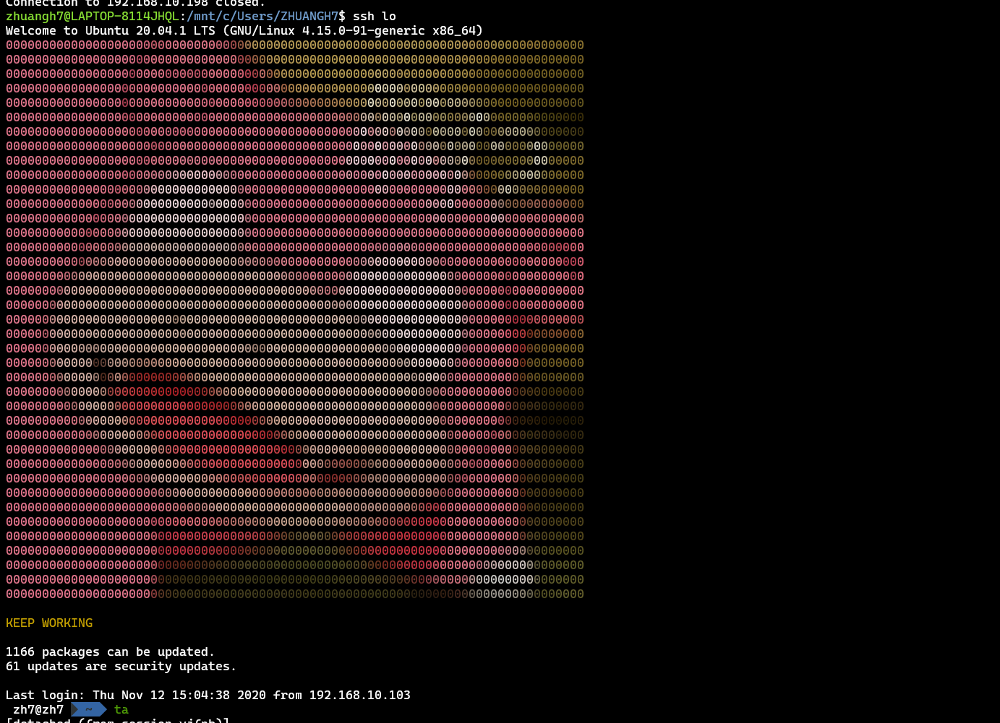

### JUEST FOR FUN
----
### TO START:
1. [translate your image to colorful htmls in this page](http://life.chacuo.net/convertphoto2char)
2. Copy the result(click the copy button or F12 for pro) and save it as a file (etc. chars\_)
3. Move the file to this directory and change it name to chars_.
4. ./boom.sh
5. relogin to see the result
6. The backup file will save in $pwd/00-header.bak. If any unexcepted things happened, plz mv this file to replace the one with same name in /etc/update-motd.d.

### RESULT:

